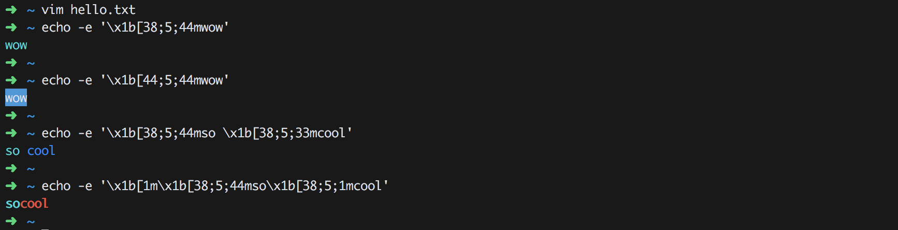

# 📠 Vim-Cheatsheet

###### vim

- Built in 1993
- ``vim`` is a popular command-line text editor

---

###### vim cheat sheet

- [Learn Vim Progressively](http://yannesposito.com/Scratch/en/blog/Learn-Vim-Progressively/)
- [Vim Commands Cheat Sheet](https://www.fprintf.net/vimCheatSheet.html)

---

###### ANSI codes

- VIM uses ansi codes

```sh
➜  ~ echo -e '\x1b[38;5;44mwow'
wow
➜  ~
```

```sh
➜  ~ echo -e '\x1b[44;5;44mwow'
wow
➜  ~
```

```sh
➜  ~ echo -e '\x1b[38;5;44mso \x1b[38;5;33mcool'
so cool
➜  ~
```

```sh
➜  ~ echo -e '\x1b[1m\x1b[38;5;44mso\x1b[38;5;1mcool'
socool
➜  ~
```



[``ANSI_escape_code`` &rarr; ``CSI_sequences``](https://en.wikipedia.org/wiki/ANSI_escape_code#CSI_sequences)

---

###### Installing VIM

```sh
sudo apt-get install vim vim-common
```

---

###### Now we're in vim!

Type `i` to go into insert mode.

Now you can type normally.

---

###### Saving and Quitting

Hit `esc` to get out of insert mode.

Now type:

```
:w foo.txt
```

to save your file as `foo.txt`.

---

You can go back into insert mode by typing `i` again or you can quit by typing:

```
:q
```

Once you've quit, you can open your file back up again by running:

```
$ vim foo.txt
```

---

or you can do just `vim` and then from command mode do:

```
:o foo.txt
```

If you've opened a file already, you can just type `:w` to save the file, you don't need to type its name every time.

---

###### Modes

- Command &rarr; ``esc``
- Insert &rarr; ``i``

---

###### Quit

- save and then quit &rarr; ``:wq``
- quit without saving &rarr; ``:q!``

---

###### Moving around

- ``h`` &rarr; moves left one character
- ``j`` &rarr; moves down one line
- ``k`` &rarr; moves up one line
- ``l`` &rarr; moves right one character

Similar shortcuts found in ``less	``, ``twitter``, tiling window managers such as ``xmonad``

- `^` or `0` &rarr; move to the start of the current line
- `$` &rarr; move to the end of the current line
- `gg` &rarr; jump to the beginning of the file
- `G` &rarr; jump to the end of the file

---

###### Delete

- `x` &rarr; delete the character under the cursor
- `dd` &rarr; delete the current line
- `d^` or `d0` &rarr; delete from the cursor to the start of the current line
- `d$` or `D` &rarr; delete from the cursor to the end of the current line
- `dG` &rarr; delete from the current position to the end of the file
- `dgg` &rarr; delete from the current position to the start of the file
- `dj` &rarr; delete the current line and the line below
- `dk` &rarr; delete the current line and the line above
- `2dd, 3dd etc` &rarr; delete the next N lines

---

###### Undo and Redo

- ``u`` &rarr; Undo
- ``ctrl + r`` &rarr; Redo

---

###### Searching

- You can search for text using regular expressions.

	- `/PATTERN` &rarr; search forward for `PATTERN`
	- `?PATTERN` &rarr; search backward for `PATTERN`

- Press:
	- `n` &rarr; jump to the next match
	- `N` &rarr; jump to the previous match

- Deletes everything from the present character till it encounters a the pattern

`d` + `/[0-9]`

---

###### Jumping

- `f + CHAR` &rarr; search forward on the current line to CHAR
- `t + CHAR` &rarr; search forward on the current line to the character before CHAR
- `F + CHAR` &rarr; search backward on the current line to CHAR
- `T + CHAR` &rarr; search backward on the current line to the character after CHAR

---

###### Jumping and deleting

- `df + CHAR` &rarr; delete forward on the current line to CHAR
- `dt + CHAR` &rarr; delete forward on the current line to the character before CHAR
- `dF + CHAR` &rarr; delete backward on the current line to CHAR
- `dT + CHAR` &rarr; delete backward on the current line to the character after CHAR

---

###### Search and Replace

```
:s/PATTERN/REPLACEMENT/FLAGS
```

```
:s/cat/dog/
:s/cat/dog/g
:s/cat/dog/i
```

```
:%s/cat/dog/ig
```

- `i` &rarr; case insensitive
- `g` &rarr; global replace (per line)

---


#### Open 2 files in split mode

```sh
$ vim -O <file_1> <file_2>
```

#### Move Cursor when split vertically

Ctrl + W + (->) or (<-)

###### Run command

| Command       | Operation             |
| ------------- |:---------------------:|
| :!w           | Save file             |
| :!ls          | List files            |
| !:python %    | execute present file  |

#### Set tab width 4

:set expandtab shiftwidth=4 softtabstop=4